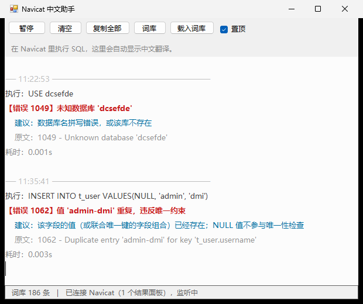

# Navicat 中文助手

把 Navicat 执行 SQL 之后「信息」面板里的**英文报错，自动翻译成中文**。

外挂式独立小程序：不用复制粘贴、不截图识别、不联网，也从不向 Navicat 写入任何内容。



## 效果

在 Navicat 里执行一句会报错的 SQL，报错原文出现在底部「信息」面板，工具窗口里同步给出中文：

| Navicat 面板里的原文 | 工具给出的中文 |
| --- | --- |
| `> 1146 - Table 'wh0524.t_user' doesn't exist` | 表 'wh0524.t_user' 不存在 |
| `> 1062 - Duplicate entry 'admin-dmi' for key 't_user.username'` | 值 'admin-dmi' 重复，违反唯一约束 |
| `> 1049 - Unknown database 'dcsefde'` | 未知数据库 'dcsefde' |
| `> 1054 - Unknown column 'ids' in 'where clause'` | 在 where clause 中找不到列 'ids' |
| `> 1452 - Cannot add or update a child row: a foreign key constraint fails (...)` | 无法新增或更新子行：外键约束失败 |

工具窗口里是这个样子（截图取自本机真实运行）：

```text
── 11:22:53 ────────────────────────────────────
执行：USE dcsefde
【错误 1049】未知数据库 'dcsefde'
    建议：数据库名拼写错误，或该库不存在
    原文：1049 - Unknown database 'dcsefde'
耗时： 0.001s

── 11:35:41 ────────────────────────────────────
执行：INSERT INTO t_user VALUES(NULL, 'admin', 'dmi')
【错误 1062】值 'admin-dmi' 重复，违反唯一约束
    建议：该字段的值（或联合唯一的字段组合）已经存在；NULL 值不参与唯一性检查
    原文：1062 - Duplicate entry 'admin-dmi' for key 't_user.username'
耗时： 0.003s
```

翻译在 `【错误 编码】` 那一行；下面灰色的是原始英文，方便对照。执行成功、没有报错时会显示 `【执行成功】没有报错`。

## 为什么不是「Navicat 插件」

Navicat 官方**没有开放第三方插件接口**（只有 PostgreSQL 的扩展管理，以及它自带的一些 AI 功能），外部程序挂不进 Navicat 里，所以「插件」这条路走不通。这里换了个等效做法：

| 方案 | 结论 |
| --- | --- |
| 做成 Navicat 插件 | ✗ 官方没有插件 SDK，外部程序无法接入 |
| 屏幕截图 + OCR 翻译 | ✗ 依赖像素识别，慢且容易认错；而报错本身就是纯文本，识别等于绕远路 |
| **外挂小程序直接读面板文本** | ✓ 面板是标准 Windows 文本框，直接取文字，准确、即时、离线 |

## 工作原理

```text
Navicat「信息」面板（Delphi/VCL 的 TMemo，就是一个普通文本框）
        │  ① 每 0.5 秒用 EnumWindows + EnumChildWindows 找到它
        ▼
WM_GETTEXT 读出面板全文（不截图、不过剪贴板）
        │  ② 面板内容有变化才继续处理，避免重复刷屏
        ▼
解析出错误码与英文原文
   > 1062 - Duplicate entry 'admin-dmi' for key 't_user.username'
   → 错误码 1062，原文 Duplicate entry 'admin-dmi' for key 't_user.username'
        │
        ▼
查本地词库（186 条 MySQL 常见错误码），把原文里的参数填进中文模板
   1062 → 值 {1} 重复，违反唯一约束   ⇒   {1} = 'admin-dmi'
        │
        ▼
浮窗显示：【错误 1062】值 'admin-dmi' 重复，违反唯一约束
```

几个实现细节：

- 面板是 Delphi/VCL 的 `TMemo`，本身带窗口句柄，所以能直接取到文字，**不需要 OCR**，也不需要你在 Navicat 里选中复制；
- 会自动跳过 SQL 编辑器（`TEEAutoCompleteMemo` / `libeeScintilla`），只读结果面板；
- 会枚举 Navicat 进程的全部顶层窗口，所以**同时开着多个查询窗口也能分别跟踪**；
- 只读不写：全程不向 Navicat 发送任何修改消息。

> 顺带一个坑：同一台机器上用 UI Automation（无障碍接口）去读这个面板，会因提供程序差异**读不到**它，只能看到旁边的空文本框和 SQL 编辑器。所以这里改用了 Win32 的子窗口枚举 + `WM_GETTEXT`，稳定得多。

## 快速开始

1. 下载 `Navicat中文助手.exe`，放到任意目录（和 `词库.txt` 放一起）；
2. 双击运行，窗口出现在屏幕右下角并默认置顶；
3. 正常用 Navicat 执行 SQL，工具窗口里就会自动出现中文翻译。

窗口按钮：`暂停` / `清空` / `复制全部` / `词库` / `载入词库` / `置顶`。关掉窗口会缩小到托盘，右键托盘图标可以退出。

需要 Windows 10 / 11，用系统自带的 .NET Framework 4.x，**不需要安装任何运行库**。

### 开机自动启动（可选）

1. 右键 `Navicat中文助手.exe` → 发送到 → 桌面快捷方式；
2. `Win + R`，输入 `shell:startup` 回车；
3. 把刚建的快捷方式拖进打开的文件夹。

## 扩充词库

词库是纯文本 `词库.txt`，一行一条，三列用 Tab 分隔：

```text
错误码 <Tab> 中文说法 <Tab> 建议
```

例如：

```text
1049	未知数据库 '{1}'	数据库名拼写错误，或该库不存在
1062	值 '{1}' 重复，违反唯一约束	该字段的值（或联合唯一的字段组合）已经存在
```

- `{1}` `{2}`：英文原文里第 1、2 个**单引号参数**的值；
- `{N1}` `{N2}`：英文原文里第 1、2 个**数字**；
- 以 `#` 开头的行是注释，不参与解析；
- 同一个错误码可以写多行（对应英文的不同措辞），程序会自动挑「参数能套上」的那一条；
- 参数取不到时输出 `？`，并在下面附上英文原文——宁可标注，也不给一个错的中文。

改完点窗口上的「载入词库」即时生效，不用重启。

查官方英文原文（按你自己的 MySQL 安装路径调整）：

```bat
"E:\IDEA\MySQL\MySQL Server 8.0\bin\perror.exe" 1049 1062
```

词库里的中文是照着 MySQL 官方模板（`bin\perror.exe`、`share\messages_to_clients.txt`）**逐条翻译并核对占位符**的，不是机翻。词库里没有的错误码会原样输出英文并标注「词库暂无此码」，不会编一个中文出来。

## 命令行参数

```bat
Navicat中文助手.exe --selftest    不监听，跑一遍翻译自检并生成 自检结果.txt
Navicat中文助手.exe --debug       写 诊断日志.txt，用于排查读不到面板的问题
```

## 自己编译

源码是单个 C# 文件、零第三方依赖，用 Windows 自带的 `csc.exe` 就能编译，不用装 Visual Studio，也不用装 .NET SDK。

最省事：双击 `编译.bat`。

手动编译（**编译前先关掉正在运行的程序**，否则 exe 被占用会编译失败）：

```powershell
$fw = "C:\Windows\Microsoft.NET\Framework64\v4.0.30319"
& "$fw\csc.exe" /nologo /target:winexe /platform:x64 /codepage:65001 `
  /out:"Navicat中文助手.exe" `
  /r:System.Windows.Forms.dll /r:System.Drawing.dll /r:System.Core.dll /r:System.dll `
  "NavicatChineseHelper.cs"
```

> 源文件里有中文，编译时必须带 `/codepage:65001`，并且源文件要保存成**带 BOM 的 UTF-8**，否则会乱码或报错。

## 目录结构

```text
Navicat中文助手/
├─ Navicat中文助手.exe      主程序，双击运行
├─ 词库.txt                 错误码中文词库，可自行扩充
├─ 使用说明.txt             随程序给最终用户的简版说明
├─ NavicatChineseHelper.cs  源码（单文件 C#，WinForms）
├─ 编译.bat                 一键编译入口
├─ build.ps1                编译.bat 实际调用的脚本
├─ 自检结果.txt             自检输出（运行 --selftest 生成）
└─ docs/
   └─ screenshot-tool.png   界面截图
```

## 常见问题

**窗口里一直没内容？**
先在 Navicat 里执行一句会报错的 SQL（比如 `USE 一个不存在的库`）。确认 Navicat 底部的「信息」面板是打开的；工具状态栏显示「已连接 Navicat（N 个结果面板）」就说明已经认出面板了。

**Navicat 关掉再打开还能用吗？**
可以，会自动找到新窗口，不用重启程序。Navicat 最小化时也能正常读取。

**会不会把数据改坏？**
不会。程序只读面板上的文字，从不向 Navicat 写入任何内容。

**能顺便把 Navicat 界面也变中文吗？**
不能，界面语言请用它自带的设置。这个工具只翻译 MySQL 服务端返回的英文报错。

## 已知限制

- 针对 Navicat（Navicat Premium 上实测）的「信息」面板做的适配，其它数据库客户端未支持；
- 词库目前覆盖 186 个常见错误码，冷门错误码只会显示英文原文；
- 界面用 WinForms 写成，未做高 DPI 缩放适配，高分屏下可能略糊；
- 编译产物未做代码签名，首次运行如果被 SmartScreen 拦，选「仍要运行」即可。
