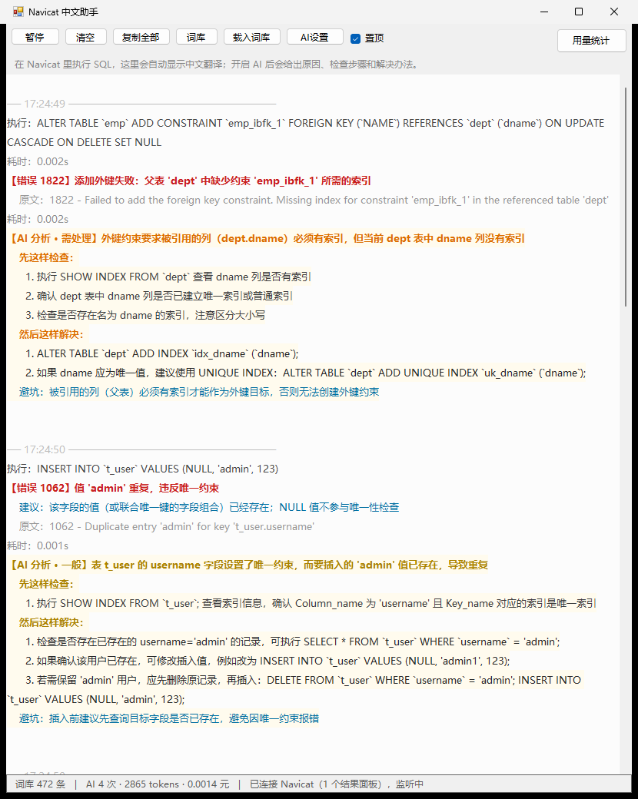
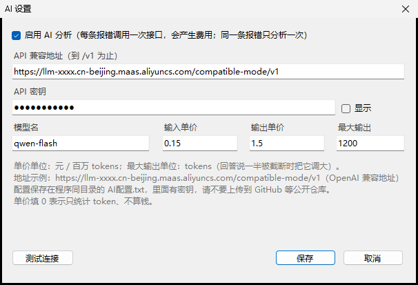
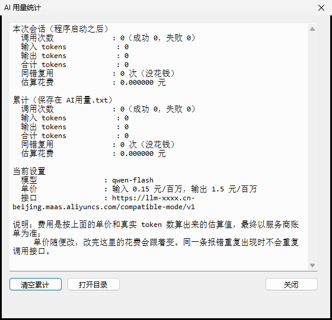

# Navicat 中文助手

把 Navicat 执行 SQL 之后「信息」面板里的**英文报错，自动翻译成中文**。

外挂式独立小程序：不用复制粘贴、不截图识别，也从不向 Navicat 写入任何内容。

- **词库翻译**：完全离线，靠本地词库把英文报错变成中文，装完就能用；
- **AI 分析（可选）**：填一个你自己的 OpenAI 兼容接口（阿里云百炼 / DashScope 等），程序会把「原因 + 怎么检查 + 怎么解决」直接写在报错下面，并按严重程度着色。不填密钥就完全不会联网。


开启 AI 之后，每条报错下面会多出一段彩色分析（下面这张是真实运行截图）：



## 效果

在 Navicat 里执行一句会报错的 SQL，报错原文出现在底部「信息」面板，工具窗口里同步给出中文：

| Navicat 面板里的原文 | 工具给出的中文 |
| --- | --- |
| `> 1146 - Table 'wh0524.t_user' doesn't exist` | 表 'wh0524.t_user' 不存在 |
| `> 1062 - Duplicate entry 'admin-dmi' for key 't_user.username'` | 值 'admin-dmi' 重复，违反唯一约束 |
| `> 1049 - Unknown database 'dcsefde'` | 未知数据库 'dcsefde' |
| `> 1054 - Unknown column 'ids' in 'where clause'` | 在 where clause 中找不到列 'ids' |
| `> 1452 - Cannot add or update a child row: a foreign key constraint fails (...)` | 无法新增或更新子行：外键约束失败 |
| `> 3819 - Check constraint 't_user_chk_1' is violated` | 检查约束 't_user_chk_1' 未通过 |
| `> 3821 - Check constraint 'ade' is not found in the table` | 表里找不到名为 'ade' 的检查约束 |

工具窗口里是这个样子（截图取自本机真实运行）：

```text
── 11:22:53 ────────────────────────────────────
执行：USE dcsefde
【错误 1049】未知数据库 'dcsefde'
    建议：数据库名拼写错误，或该库不存在
    原文：1049 - Unknown database 'dcsefde'
耗时： 0.001s

── 11:35:41 ────────────────────────────────────
执行：INSERT INTO t_user VALUES(NULL, 'admin', 'dmi')
【错误 1062】值 'admin-dmi' 重复，违反唯一约束
    建议：该字段的值（或联合唯一的字段组合）已经存在；NULL 值不参与唯一性检查
    原文：1062 - Duplicate entry 'admin-dmi' for key 't_user.username'
耗时： 0.003s
```

翻译在 `【错误 编码】` 那一行；下面灰色的是原始英文，方便对照。执行成功、没有报错时会显示 `【执行成功】没有报错`。

如果开了 AI，报错下面还会跟一段分析（下面是 1822 这条的真实输出）：

```text
【错误 1822】添加外键失败：父表 'dept' 中缺少约束 'emp_ibfk_1' 所需的索引
    原文：1822 - Failed to add the foreign key constraint. Missing index for constraint 'emp_ibfk_1' in the referenced table 'dept'
【AI 分析 · 需处理】外键约束要求被引用的列（dept.dname）必须有索引，但当前 dept 表中 dname 列没有索引
    先这样检查：
      1. 执行 SHOW INDEX FROM `dept` WHERE Column_name = 'dname'; 查看 dname 是否有索引
      2. 在 Navicat 中打开 dept 表结构，检查 dname 列是否已创建索引
      3. 确认 dname 列是否允许重复值，若不允许则需建唯一索引
    然后这样解决：
      1. 执行 ALTER TABLE `dept` ADD INDEX `idx_dname` (`dname`); 为 dname 列添加普通索引
      2. 若 dname 应唯一，可改为 ALTER TABLE `dept` ADD UNIQUE INDEX `uniq_dname` (`dname`);
      3. 添加索引后再次执行原 ALTER TABLE 语句
    避坑：外键引用的列必须有索引；索引建好后重新执行那句 ALTER TABLE 即可
```

标题里的级别按严重程度用颜色区分，一眼就能看出要不要马上处理：

| 级别 | 颜色 | 什么情况 |
| --- | --- | --- |
| 严重 | 红 | 连不上数据库、权限不足、数据损坏或可能丢数据 |
| 需处理 | 橙 | 要改表结构、索引、约束、外键、建表语句 |
| 一般 | 黄 | 数据值重复、字段名拼写、类型不匹配、SQL 写错 |
| 提示 | 绿 | 不是错误，只是提示 |

## 为什么不是「Navicat 插件」

Navicat 官方**没有开放第三方插件接口**（只有 PostgreSQL 的扩展管理，以及它自带的一些 AI 功能），外部程序挂不进 Navicat 里，所以「插件」这条路走不通。这里换了个等效做法：

| 方案 | 结论 |
| --- | --- |
| 做成 Navicat 插件 | ✗ 官方没有插件 SDK，外部程序无法接入 |
| 屏幕截图 + OCR 翻译 | ✗ 依赖像素识别，慢且容易认错；而报错本身就是纯文本，识别等于绕远路 |
| **外挂小程序直接读面板文本** | ✓ 面板是标准 Windows 文本框，直接取文字，准确、即时、离线 |

## 工作原理

```text
Navicat「信息」面板（Delphi/VCL 的 TMemo，就是一个普通文本框）
        │  ① 每 0.5 秒用 EnumWindows + EnumChildWindows 找到它
        ▼
WM_GETTEXT 读出面板全文（不截图、不过剪贴板）
        │  ② 面板内容有变化才继续处理，避免重复刷屏
        ▼
解析出错误码与英文原文
   > 1062 - Duplicate entry 'admin-dmi' for key 't_user.username'
   → 错误码 1062，原文 Duplicate entry 'admin-dmi' for key 't_user.username'
        │
        ▼
查本地词库（472 条 MySQL 错误码，覆盖 1xxx / 2xxx / 3xxx 段），把原文里的参数填进中文模板
   1062 → 值 {1} 重复，违反唯一约束   ⇒   {1} = 'admin-dmi'
        │
        ▼
浮窗显示：【错误 1062】值 'admin-dmi' 重复，违反唯一约束
```

几个实现细节：

- 面板是 Delphi/VCL 的 `TMemo`，本身带窗口句柄，所以能直接取到文字，**不需要 OCR**，也不需要你在 Navicat 里选中复制；
- 会自动跳过 SQL 编辑器（`TEEAutoCompleteMemo` / `libeeScintilla`），只读结果面板；
- 会枚举 Navicat 进程的全部顶层窗口，所以**同时开着多个查询窗口也能分别跟踪**；
- 只读不写：全程不向 Navicat 发送任何修改消息。

> 顺带一个坑：同一台机器上用 UI Automation（无障碍接口）去读这个面板，会因提供程序差异**读不到**它，只能看到旁边的空文本框和 SQL 编辑器。所以这里改用了 Win32 的子窗口枚举 + `WM_GETTEXT`，稳定得多。

## 快速开始

1. 下载 `Navicat中文助手.exe`，放到任意目录（和 `词库.txt` 放一起）；
2. 双击运行，窗口出现在屏幕右下角并默认置顶；
3. 正常用 Navicat 执行 SQL，工具窗口里就会自动出现中文翻译。

窗口按钮：`暂停` / `清空` / `复制全部` / `词库` / `载入词库` / `AI设置` / `置顶`，最右边是 `用量统计`。关掉窗口会缩小到托盘，右键托盘图标可以退出。

需要 Windows 10 / 11，用系统自带的 .NET Framework 4.x，**不需要安装任何运行库**。

### 开机自动启动（可选）

1. 右键 `Navicat中文助手.exe` → 发送到 → 桌面快捷方式；
2. `Win + R`，输入 `shell:startup` 回车；
3. 把刚建的快捷方式拖进打开的文件夹。

## AI 分析（可选）

不开也能用，词库翻译是主功能。想让程序顺便讲清「为什么错、怎么查、怎么修」，就配一下接口。

### 怎么配

点窗口上的 **`AI设置`** 按钮，填 5 个东西：

| 项目 | 填什么 |
| --- | --- |
| 接口地址 | OpenAI 兼容地址，**到 `/v1` 为止**，例如 `https://xxx.cn-beijing.maas.aliyuncs.com/compatible-mode/v1` |
| API 密钥 | 服务商给的 key，填完可以点「显示」核对；窗口里打码显示 |
| 模型 | 例如 `qwen-flash`、`qwen3.8-flash`，填错会提示模型不存在 |
| 输入 / 输出单价 | 元 / 百万 tokens，用来估算花了多少钱；填 0 就只统计 token 不算钱 |
| 最大输出 tokens | 默认 1200。回答被截断时，程序会提示你把这个值调大 |



填完点 **「测试连接」**，它会真的发一次请求回来，告你「连接成功」还是具体哪里不对，并显示这次消耗了多少 token、花了多少钱。

设置保存在同目录的 `AI配置.txt`（纯文本，可直接编辑，格式是 `键=值`，`#` 开头是注释）。程序启动时读它，**改完点「测试连接」或重启程序生效**。

### 会不会很贵

按 token 实计，默认单价（qwen-flash ≤128k 档：输入 0.15 元/百万、输出 1.5 元/百万）算下来，**解释一条报错大约 0.0008 元**，也就是一千条报错不到 1 块钱。两个省钱机制：

- **同一条错误只花钱一次**：错误签名（错误码 + 英文原文 + SQL）相同就直接复用上次的分析，并在下面标注「复用上次的分析，没再花钱」；
- **不填密钥就不调用**：没配密钥时只在日志里提示一次，之后静默跳过，全程离线。

### 花了多少钱、用了多少 token

点窗口最右上的 **`用量统计`**，能看到两套数字：

```text
本次会话
  调用次数  : 4（成功 4，失败 0）
  输入 tokens : 1,013
  输出 tokens : 414
  合计 tokens : 1,427
  同错复用  : 0 次（没花钱）
  估算花费  : 0.000773 元

累计（保存在 AI用量.txt）
  调用次数  : 12（成功 12，失败 0）
  ...

当前设置
  模型  : qwen-flash
  单价  : 输入 0.15 元/百万，输出 1.5 元/百万
  接口  : https://.../compatible-mode/v1
```

累计数写在 `AI用量.txt` 里，关掉程序也不丢；窗口里有「清空累计」和「打开目录」两个按钮。费用是按你填的单价和接口真实返回的 token 数算出来的**估算值**，最终以服务商账单为准。



状态栏也会实时显示一行：`AI 4 次 · 2865 tokens · 0.0014 元`。

### 它到底发了什么出去

每次分析只发三样东西，都是这条报错本身的上下文，不发你的表数据：

1. 出错的那条 SQL；
2. 错误码 + 英文原文；
3. 本地词库给出的中文大意（帮助模型别跑偏）。

system 提示词要求它**只输出一个 JSON**（`level` / `why` / `check` / `fix` / `tip`），所以列表、编号、配色都是程序按 JSON 渲染的，不是让模型自由发挥。回答万一没按格式来（比如被长度上限截断），程序会退化成「按字段抽取」显示，并在下面标注；实在解析不出来才会把模型原话贴出来，绝不假装成功。

> ⚠️ `AI配置.txt` 里有你的密钥，**不要提交到公开仓库**。本仓库的 `.gitignore` 已经把它和 `AI用量.txt`、`AI自检.txt` 一起忽略了。

## 扩充词库

词库是纯文本 `词库.txt`，一行一条，三列用 Tab 分隔：

```text
错误码 <Tab> 中文说法 <Tab> 建议
```

例如：

```text
1049	未知数据库 '{1}'	数据库名拼写错误，或该库不存在
1062	值 '{1}' 重复，违反唯一约束	该字段的值（或联合唯一的字段组合）已经存在
```

- `{1}` `{2}`：英文原文里第 1、2 个**单引号参数**的值；
- `{N1}` `{N2}`：英文原文里第 1、2 个**数字**（按英文里数字出现顺序取，所以英文里更靠前的数字会先被占用）；
- 以 `#` 开头的行是注释，不参与解析；
- 同一个错误码可以写多行（对应英文的不同措辞），程序会自动挑「参数能套上」的那一条；
- 参数取不到时输出 `？`，并在下面附上英文原文——宁可标注，也不给一个错的中文。

改完点窗口上的「载入词库」即时生效，不用重启。

查官方英文原文（按你自己的 MySQL 安装路径调整）：

```bat
"E:\IDEA\MySQL\MySQL Server 8.0\bin\perror.exe" 1049 1062
```

词库里的中文是照着 MySQL 官方模板（`bin\perror.exe`、`share\messages_to_clients.txt`）**逐条翻译并核对占位符**的，不是机翻。词库里没有的错误码会原样输出英文并标注「词库暂无此码」，不会编一个中文出来。

## 命令行参数

```bat
Navicat中文助手.exe --selftest    不监听，跑一遍翻译自检并生成 自检结果.txt
Navicat中文助手.exe --aitest      真的调用一次 AI 接口，生成 AI自检.txt（含 token 与花费）
Navicat中文助手.exe --demo        不依赖 Navicat，直接喂几条样例报错走完整流程（含 AI 分析）
Navicat中文助手.exe --debug       写 诊断日志.txt，用于排查读不到面板的问题
```

`--demo` 是给「想看看 AI 分析长什么样、又不想故意写错 SQL」准备的：启动后会自己造 1822 / 1062 / 1054 / 1049 四条样例，AI 分析照常出现。它会真的调用接口，注意会产生一点点费用。

## 自己编译

源码是单个 C# 文件、零第三方依赖，用 Windows 自带的 `csc.exe` 就能编译，不用装 Visual Studio，也不用装 .NET SDK。

最省事：双击 `编译.bat`。

手动编译（**编译前先关掉正在运行的程序**，否则 exe 被占用会编译失败）：

```powershell
$fw = "C:\Windows\Microsoft.NET\Framework64\v4.0.30319"
& "$fw\csc.exe" /nologo /target:winexe /platform:x64 /codepage:65001 `
  /out:"Navicat中文助手.exe" `
  /r:System.Windows.Forms.dll /r:System.Drawing.dll /r:System.Core.dll /r:System.dll `
  "NavicatChineseHelper.cs"
```

> 源文件里有中文，编译时必须带 `/codepage:65001`，并且源文件要保存成**带 BOM 的 UTF-8**，否则会乱码或报错。

## 目录结构

```text
Navicat中文助手/
├─ Navicat中文助手.exe      主程序，双击运行
├─ 词库.txt                 错误码中文词库，可自行扩充
├─ AI配置.txt               AI 接口设置（含密钥，不上传；首次点「AI设置」后保存）
├─ AI用量.txt               AI token 与花费的累计记录（运行时生成，不上传）
├─ AI自检.txt               --aitest 的输出（不上传）
├─ 使用说明.txt             随程序给最终用户的简版说明
├─ NavicatChineseHelper.cs  源码（单文件 C#，WinForms）
├─ 编译.bat                 一键编译入口
├─ build.ps1                编译.bat 实际调用的脚本
├─ 自检结果.txt             自检输出（运行 --selftest 生成）
└─ docs/
   ├─ screenshot-tool.png   界面截图
   ├─ screenshot-ai.png        AI 分析效果截图
   ├─ screenshot-ai-settings.png  AI 设置窗口截图
   └─ screenshot-stats.png     用量统计窗口截图
```

## 常见问题

**窗口里一直没内容？**
先在 Navicat 里执行一句会报错的 SQL（比如 `USE 一个不存在的库`）。确认 Navicat 底部的「信息」面板是打开的；工具状态栏显示「已连接 Navicat（N 个结果面板）」就说明已经认出面板了。

**Navicat 关掉再打开还能用吗？**
可以，会自动找到新窗口，不用重启程序。Navicat 最小化时也能正常读取。

**会不会把数据改坏？**
不会。程序只读面板上的文字，从不向 Navicat 写入任何内容。

**能顺便把 Navicat 界面也变中文吗？**
不能，界面语言请用它自带的设置。这个工具只翻译 MySQL 服务端返回的英文报错。

**AI 那段一直不出来？**
先看状态栏：显示 `AI 未开启` 就去「AI设置」把开关打开；显示 `AI 待配置` 就是密钥或地址没填。再点一次「测试连接」，它会直接告你是地址、密钥、模型名哪儿不对。如果状态栏显示 `AI 失败` 之类，窗口里会写出具体错误和排查提示。

**AI 回答被截断了？**
说明这次回答太长，被「最大输出 tokens」切断了。程序会按字段尽量把已经拿到的内容显示出来，并在下面标注。想更完整就把「AI设置」里的最大输出调大（比如 2000），单价不变，只是这一条会多花一点点。

**为什么同一条报错第二次不再问 AI？**
同一个错误签名（错误码 + 英文原文 + SQL）会复用上次结果，这样反复执行同一句 SQL 不会重复花钱。

**密钥安全吗？**
密钥只存在本机的 `AI配置.txt` 里，除了发给你填的那个接口，不会发往任何别处；程序也不读取宿主机上其它任何文件。注意别把这个文件提交到公开仓库（`.gitignore` 已忽略）。

## 已知限制

- 针对 Navicat（Navicat Premium 上实测）的「信息」面板做的适配，其它数据库客户端未支持；
- 词库目前覆盖 472 个错误码（以 MySQL 服务端 1xxx / 2xxx / 3xxx 段为主），更冷门的错误码只会显示英文原文；
- AI 分析用你自备的接口，回答质量取决于所选模型；它给的是**排查建议**，改表结构、删数据这类语句执行前请自己再确认一遍；
- AI 请求最多两条并发，回答通常几秒内回来，网络慢时会久一点，期间日志里会显示「正在请 xxx 分析错误 1822 …」；
- 界面用 WinForms 写成，未做高 DPI 缩放适配，高分屏下可能略糊；
- 编译产物未做代码签名，首次运行如果被 SmartScreen 拦，选「仍要运行」即可。